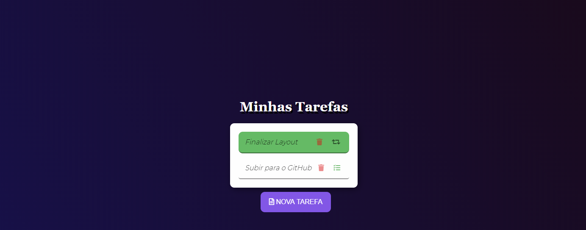

<h1 align="center">
  Todo App
   
  
</h1>

  <a href="#-projeto">Projeto</a>&nbsp;&nbsp;&nbsp;

  

 

 

  

## 🚀 Tecnologias

Este projeto foi gerado com [Angular CLI](https://github.com/angular/angular-cli) version 9.1.7.

## 💻 Projeto
Este é um projeto que lista suas tarefas diárias é um projeto de estudo inicial com [Angular](https://angular.io/)

## Servidor de desenvolvimento
Execute `ng serve` para um servidor de desenvolvimento. Navegue para `http://localhost:4200/.` O aplicativo será recarregado automaticamente se você alterar qualquer um dos arquivos de origem.

## Development server

Run `ng serve` for a dev server. Navigate to `http://localhost:4200/`. The app will automatically reload if you change any of the source files.
